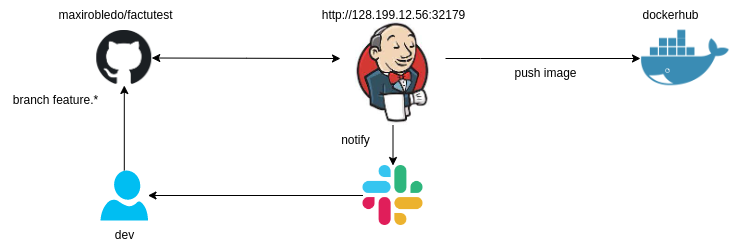

# CI/CD

## Introduction

This deployment ensures that the continuous integration process is executed when a any developer commit to any feature branch. This allows a pipeline to be activated on the current instance of jenkins. The pipeline build the project and push the image to DockerHub.
Finally the developer is notified through a slack channel.



## Jenkins install
```bash
kubectl create namespace jenkins
helm repo add jenkins https://charts.jenkins.io
helm repo update
helm install jenkinsjenkins/jenkins -n jenkins --values values.yaml
```
Note: Set up NodePort ServiceType on values.yaml file  
Repo source: https://github.com/jenkinsci/helm-chats

